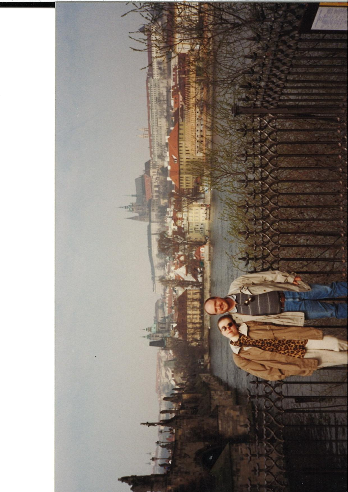
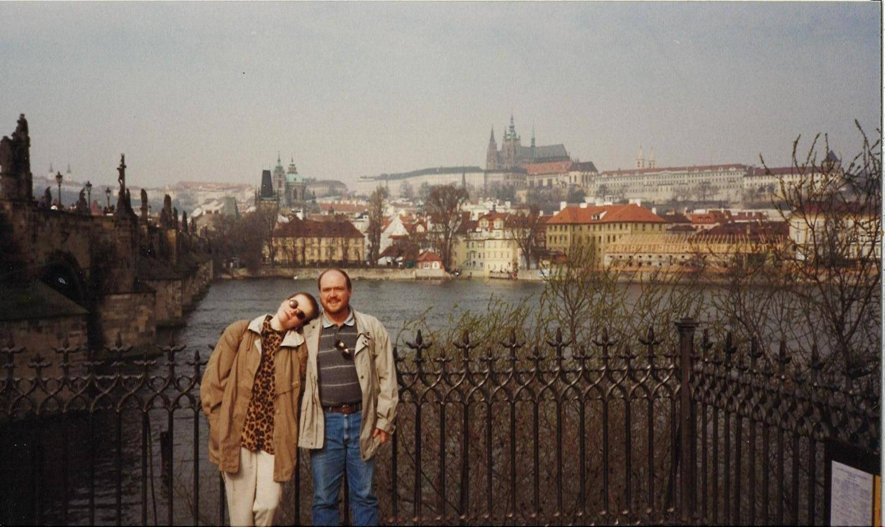
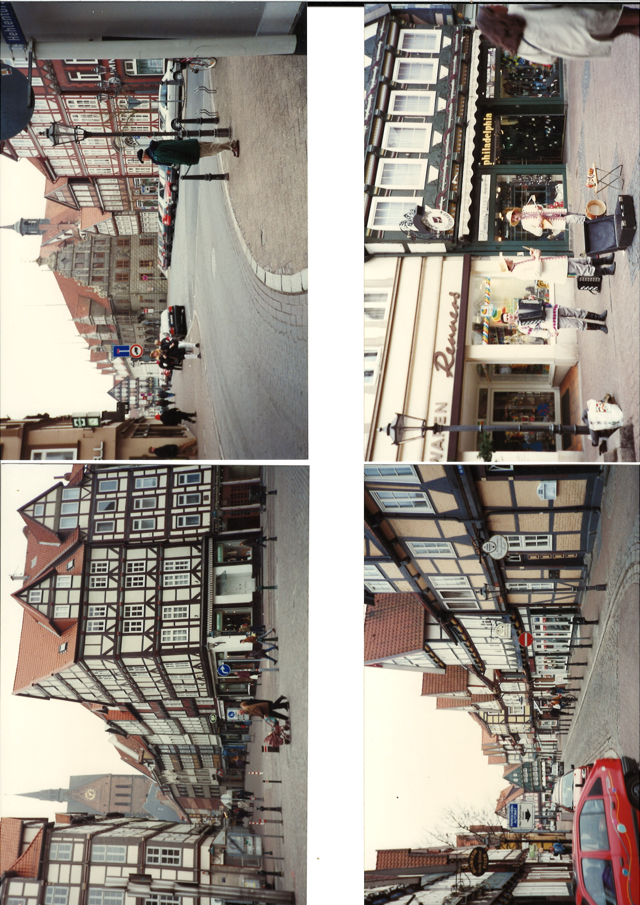
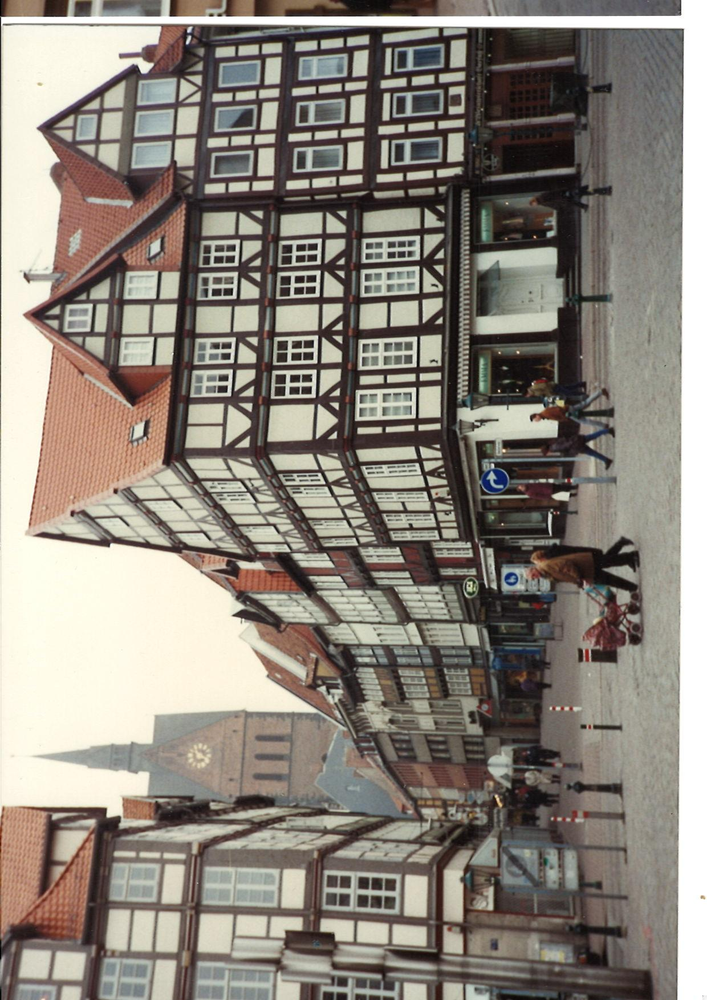
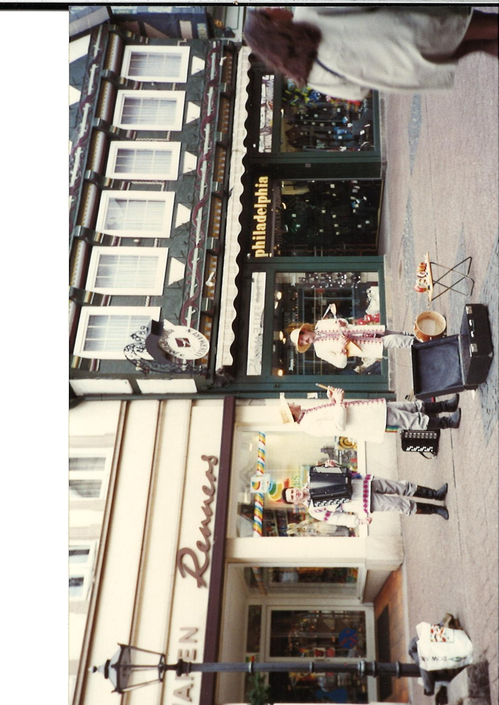
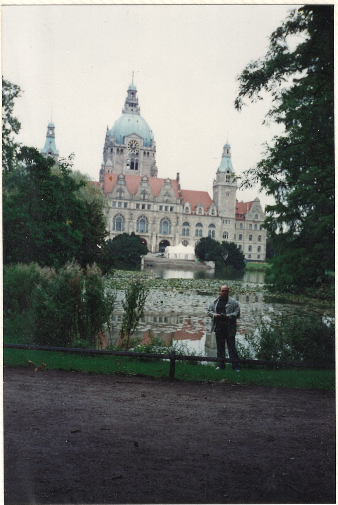

# Image Processing Project Overview

This project is part of my bigger project of scanning and digitalization of you family's old photo albums. While scanning its self takes a lot of time, each scan also requires a lot of hand work, like white background removal. So this code project is just me trying to automate processing of the photos.

Mainly this project relies on OpenCV library. The core of the project is divided into two segments: the functional implementations within `functions.py` and their validation through unit tests in `test_functions.py`.

## Key Features

### 1. **Remove White Background** (`remove_white`)
- **Description**: The scan of some picture usually leaves some plain white background that ruins vibe of the picture. This function removes it as much as it can.
- **Input**: Path to the image file.
- **Output**: The image with the white background removed, or the original image if no contours are detected.

### 2. **Crop Image into Four Equal Pieces** (`crop_in_four_pieces`)
- **Description**: A lot of out photo albums contain kinda small pictures, that can four of them can be fit on single A4 paper. To save time, I have scanned four of them at the same time, and then to get individuals pictures i used this function to just chop original picture in the four smaller ones.
- **Input**: Path to the image file.
- **Output**: Four cropped sections of the original image.

### 3. **Get Pictures** (`get_pictures`)
- **Description**: Other types of our albums, have pictures directly glued to the pages of the album, in this case I just scanned whole page, and used this function to extract individual photos out of the original scan. 
- **Input**: Path to the image file.
- **Output**: Cropped images based on the filtered contours.


## Examples

### 1. **Remove White Background**

#### Original Photo


#### After `remove_white`


### 2. Crop Image in Four Equal Pieces

#### Original Photo


#### After `crop_in_four_pieces`
1. 
2. 
3. 
4. 

### 3. Get Pictures

#### Original Photo


#### After `get_pictures`
1. 
2. 


## Testing

The file `test_functions.py` is used to test all the functions above, and ensure that they work as they should.
- Removing white backgrounds, with and without detected contours.
- Cropping an image into four equal parts and verifying each segment's integrity.
- Extracting images through contour filtering and validating the expected number of cropped images.

## Getting Started

### Prerequisites
Ensure Python is installed on your system, along with the OpenCV library. Install OpenCV using pip:

```bash
pip install opencv-python-headless